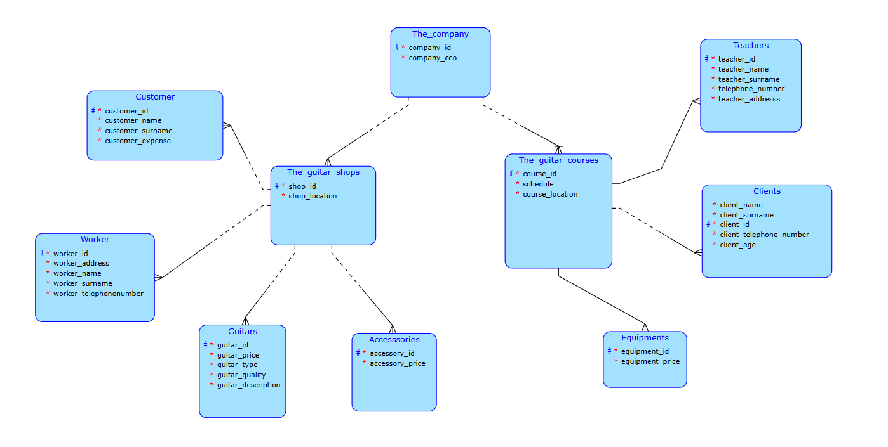

# Guitar Company Database

A relational database system designed for managing the operations of a guitar company. The project models both the company's guitar shops and guitar courses, including employees, customers, teachers, clients, products, equipment, and their relationships.

This project was developed as part of a university **Database Systems** course.

---

## 📌 Project Overview

The database models a company that operates two business areas:

- 🎸 Guitar Shops
- 🎓 Guitar Courses

The guitar shops manage products, accessories, employees, and customers, while the guitar courses manage teachers, students, schedules, and equipment.

The project includes the complete database design process, from conceptual modeling to SQL implementation and querying.

---

## ✨ Features

- Relational database design
- Conceptual Entity-Relationship (ER) model
- SQL database creation scripts
- Sample data population
- Collection of SQL queries demonstrating data retrieval and analysis
- Real-world business scenario

---

## 🗂 Repository Structure

```
guitar-company-database/
│
├── README.md
│
├── schema/
│   └── conceptual_schema.png
│
├── sql/
│   ├── create_tables.sql
│   ├── insert_data.sql
│   └── queries.sql
│
└── documentation/
    └── project_report.pdf
```

---

## 🛠 Technologies

- SQL
- Relational Database Design
- Entity-Relationship Modeling (ERD)

---

## 📊 Database Contents

The database contains entities representing:

- Company
- Guitar Shops
- Guitar Courses
- Workers
- Customers
- Clients
- Teachers
- Guitars
- Accessories
- Equipment

The entities are connected through relationships that model the company's operations.

---

## 📈 SQL Functionality

The project contains approximately **35 SQL queries**, including:

- Data retrieval
- Filtering
- Sorting
- Aggregation
- Joins
- Updates
- Deletes
- Views

Example tasks include:

- Finding customers and clients
- Listing guitar information
- Retrieving teacher data
- Displaying equipment prices
- Updating product prices
- Creating SQL views

---

## 🖼 Conceptual Schema

The repository includes the conceptual ER diagram used during database design.

*(Insert the schema image below if GitHub doesn't display it automatically.)*



---

## 🎯 Learning Outcomes

This project demonstrates practical experience with:

- Relational database modeling
- Primary and foreign keys
- Entity relationships
- SQL scripting
- Database normalization
- Query optimization concepts

---

## 👨‍🎓 Academic Project

This repository contains coursework completed for a university **Database Systems** class and is shared as part of my software engineering portfolio.
